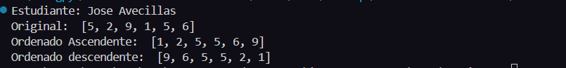
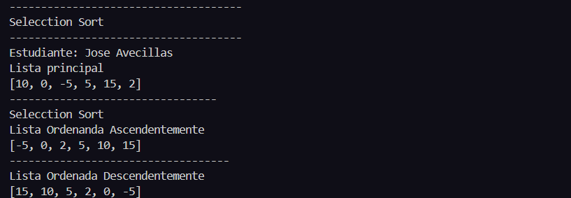
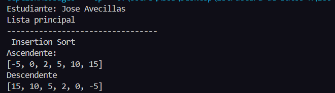
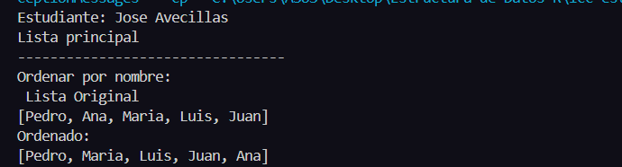
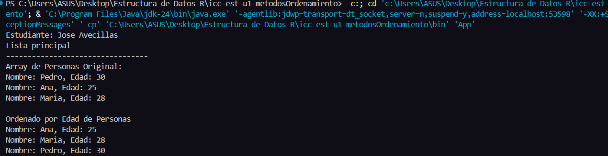
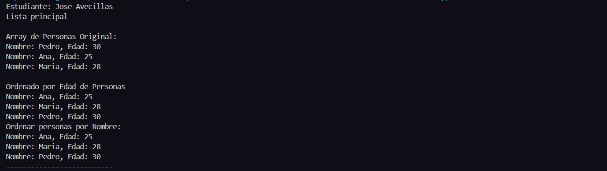

# Estructura de Datos

**Estudiante:** Jose Avecillas 

## Metodos Ordenamiento

### Practica 2 - 20/OCT
Metodo Sort Bubble

### Practica 2 - 21/OCT
Metodo Sort Selecction en Java y Python

Salida de Python

Salida de Java

### Practica 3 - 23/OCT

